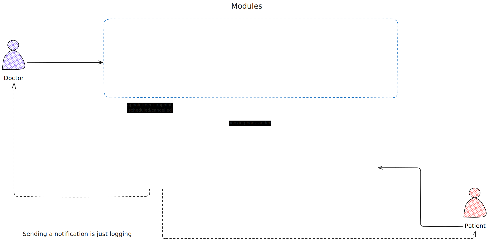

# Docbooking

A very simple appointment booking system for doctors and patients in a monolithic architecture.

Meaning it's simple does't mean it's good!:
- It uses in-memory storage for simplicity
- In-memory event bus for simplicity
- Just one single dependency for uuid generation (will be replaced later)

## Requirements
* Just `Go` installed on your machine and make if you're lazy.
* To run either `make run` or `go run cmd/app/main.go`

## The Flow
1. The doctor adds his availability slots (availability module)
2. The patient books an appointment (booking module)
3. The doctor confirms the appointment (confirmation module), then a notification is sent to the patient and the doctor
4. When the appointment is completed, the doctor marks it as completed (appointment module)

## TODO
- [ ] Have zero dependencies!
- [ ] Add tests (unit and integration)
- [ ] Correctly separate errors in different layers
- [ ] Return proper error messages to the client
